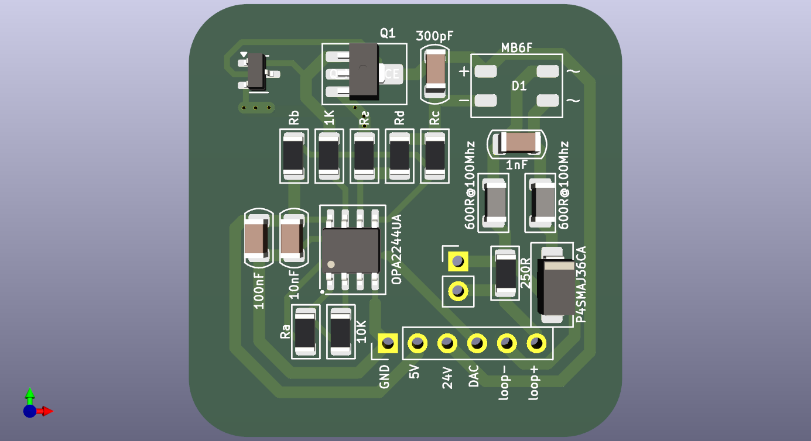

# current-to-voltage-loop  
  
    
    
  
[采用 HART® 调制解调器的高精度环路供电式 4mA 至 20mA 现场变送器参考设计](https://www.ti.com.cn/tool/cn/TIDA-01504)  
  
器件OPA2244UA,NPN三极管  
  
OPA2244UA  
IQ 50uA/channl  
单位增益稳定  
V = +2.6V~+36V(单电源)  
Vs 1.5mV  
IB -2.5nA  
en 22nV/√Hz@1Khz  
GBW 430KHZ  
SR –0.1/+0.16V/µs  
  
NPN三极管 SOT-23-3或者SOT-89-3封装  
比如BCX54  
https://www.jlc-smt.com/lcsc/detail?componentCode=C475647  
collector 集电极  
base 基极  
emitter 发射极  
power dissipation 功率耗散  
breakdown voltage 击穿电压  
cut-off current 截止电流  
DC current gain 直流电流增益  
saturation voltage 饱和电压  
peak base current 基极峰值电流  
peak collector current 集电极峰值电流  
transition frequency 过渡频率  
  
关键参数:  
Vceo 45V > 36V 不会被击穿  
IC 1A > 20mA 不会过流  
PD 1.3W > 600mW 可以36V直接输入  
ICBO 集电极截止电流 100nA << 4mA 不会影响电流信号输出  
hFE 直流电流增益 25~250, 这是对设计的限制  
Vce(sat) 饱和电压 0.5V 对设计的限制  
VBE 开启电压 1V 这是对设计的限制  
  
4mA~20mA电流环路设计 V-I转换器  
  
深度负反馈回路 OPA(IN-)->OPA(OUT)->NPN(B)->NPN(E)->Re->GND->OPA(IN-).  
NPN 一直工作在放大区域, VB 恒大于NPN(Vbe), 同时 VE > VB, 结果是 Ic = (hFE)Ib  
  
当深度反馈建立后 VOPA(IN+) = VOPA(IN-) = VGND  
  
Id * Rd = Ic * Rc -> Id = Ic * Rc / Rd  
  
此时 Ic = vref / Rb + VDAC / Ra  
  
Iloop = Id + Ic = (1 + Rc / Rd) * Ic = (1 + Rc / Rd) * (vref / Rb + VDAC / Ra  
  
V-I 增益为 gain = (1 + Rc / Rd)  
  
具体电阻值可以通过python来计算  
  
BUSvoltage = LDO-VIN(min) + 2x0.7V + (Rload + Rd) * Iloop(max)  
一般取 Rload = 250R 2x0.7V(三极管正向偏置电压)  
  
LDO 可以加上限流电阻(200R)改善整体接收器阻抗  
  
NPN工作在放大区域, VCE > VBE > 0.7V   
  
Re < Vb(max)/ 20mA  
  
BUS voltage = Vce + (Rd + Re + Rload) * 20mA + 2x0.7V  
  
同时通过LTspice仿真发现, Re 过小会导致Vb过小,不能驱动NPN  
  
NPN的限流电阻取1K即可.